# Note-Z App

Note-Z is a next-generation, location-based note-taking app crafted exclusively for Gen-Z. It delivers a playful, cartoon-style map interface that emphasizes focused, short-term task management with a sleek, modern design.

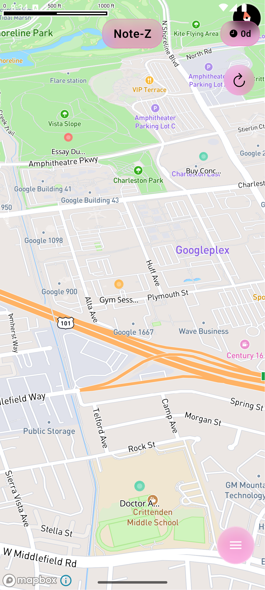

## 🚀 Features in v0.0.0

- **Weekly Reset System**: All notes automatically reset every Sunday, encouraging a fresh start each week and reducing digital clutter
- **Location-Based Notes**: Drop pins anywhere on the map to create geo-tagged notes and reminders
- **Modern UI/UX Design**: Apple-inspired design philosophy with frosted glass effects, clean typography, and proper spacing
- **Interactive Map Experience**: Smooth animations when navigating the map, with color-coded markers for different urgency levels
- **Note Management**:
  - Create notes with title, description, and optional deadline
  - View all notes in a convenient bottom sheet list
  - Filter notes by day of the week
  - Edit or delete existing notes
  - Auto-categorization of notes by urgency based on deadline proximity
- **Visual Prioritization**: Color coding of notes based on deadline urgency (low, medium, high, past due)
- **Local Data Privacy**: All data stored locally on your device - no accounts, no cloud storage, no tracking

## 📱 App Screenshots

### Map View and Navigation
| Map with Notes | Navigating to a Note |
|----------------|----------------------|
|  | 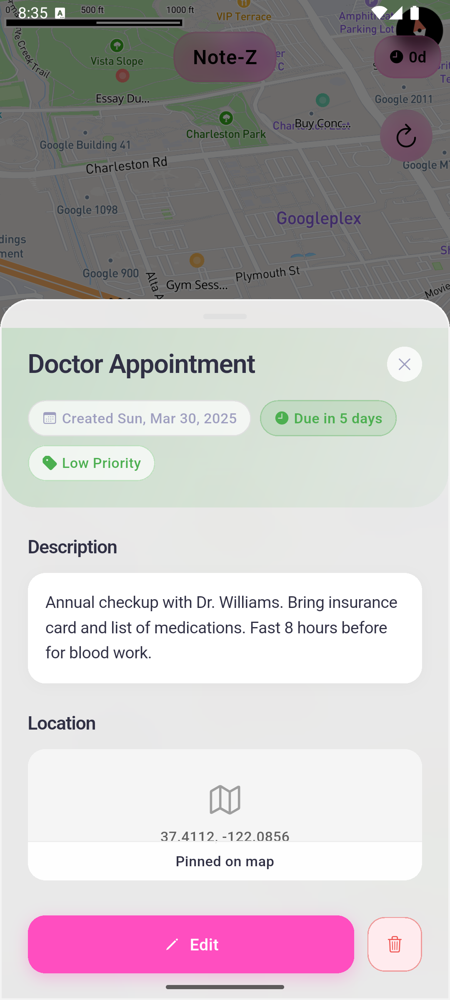 |

### Note Management
| Create Note | Edit Note | Note Details |
|-------------|-----------|--------------|
| 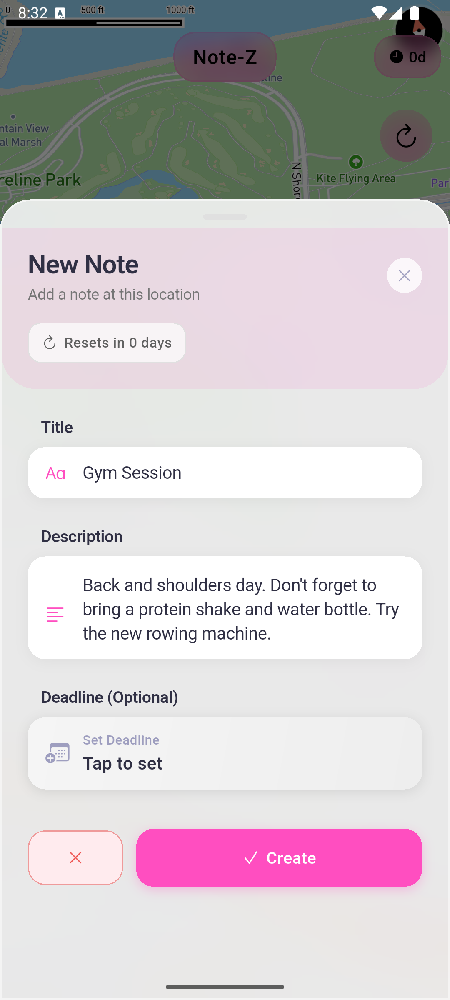 | 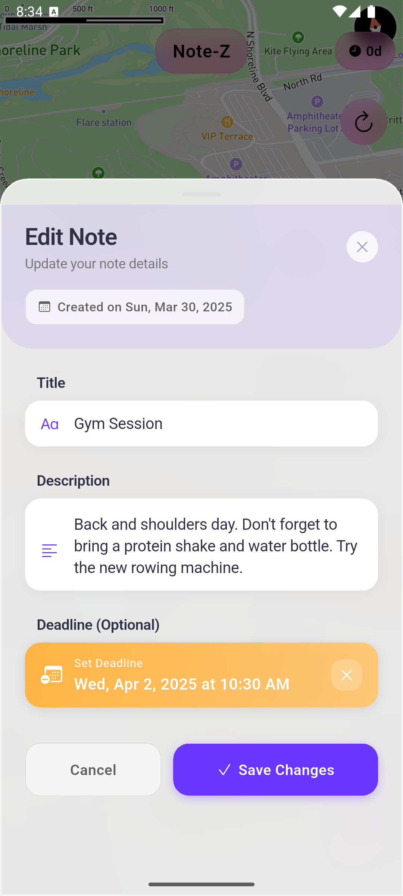 | 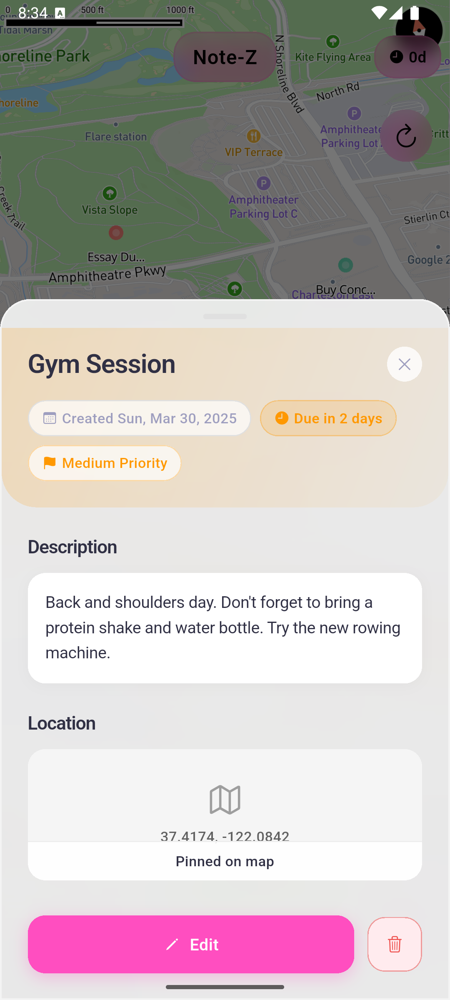 |

### List View and Filtering
| All Notes | Filter by Monday | Filter by Wednesday | Filter by Friday | Filter by Saturday |
|-----------|------------------|---------------------|------------------|-------------------|
| 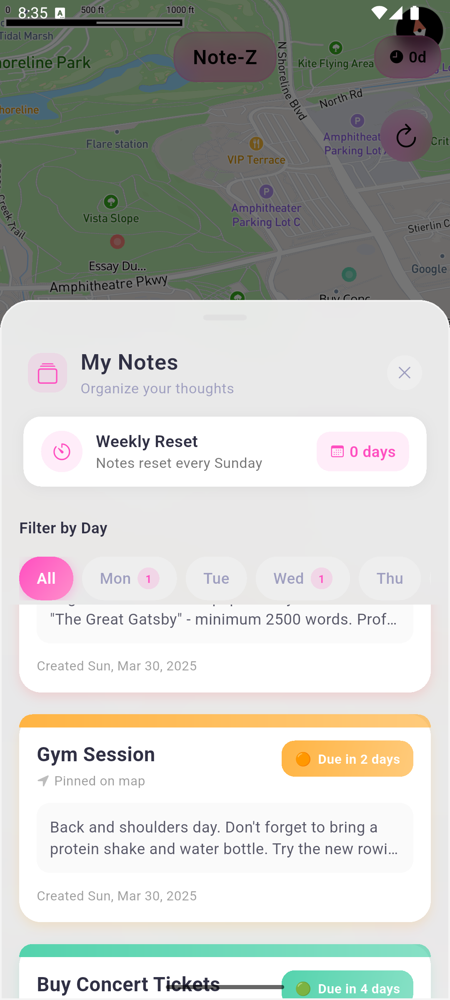 | 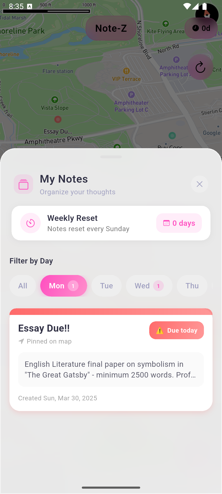 | 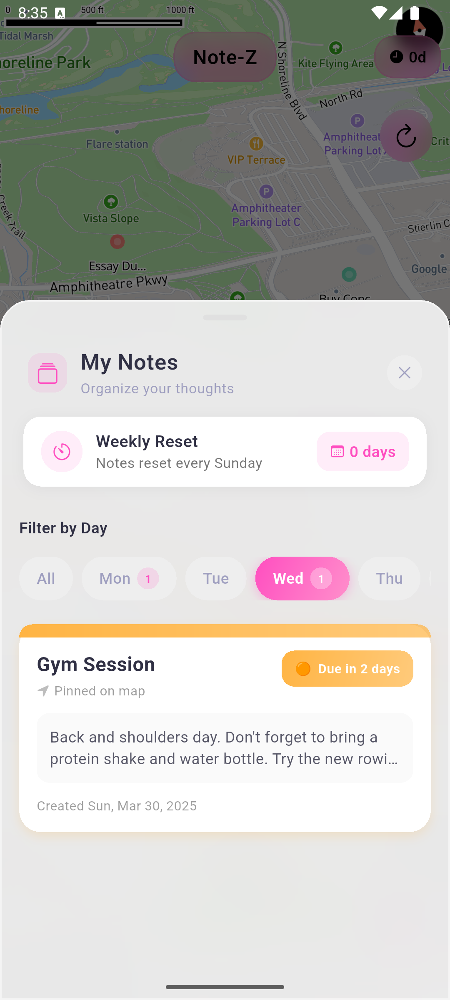 | 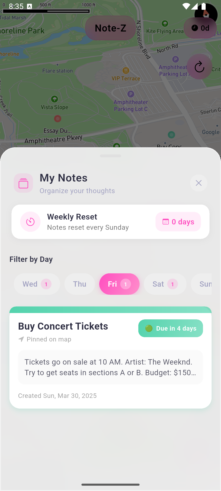 | 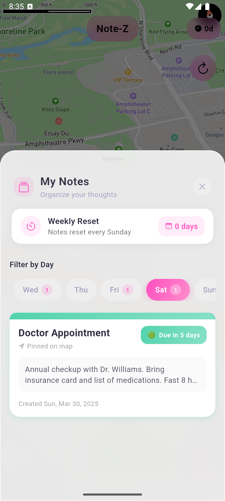 |

### Empty States
| Empty Notes List | Empty Note View |
|------------------|----------------|
|  | 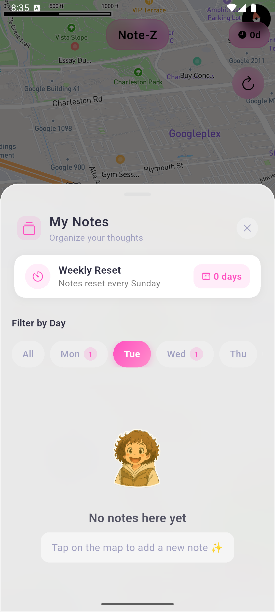 |

## 🔧 Setup & Installation

### Prerequisites

- Flutter SDK (version ^3.7.2)
- Dart (latest stable)
- Mapbox account and access token
- Android Studio/VS Code with Flutter extension
- iOS: XCode (for MacOS users)
- Android: Android Studio with emulator setup

### Step-by-Step Installation

1. **Clone the repository**
   ```bash
   git clone https://github.com/ifarangiis/Note-Z.git
   cd Note-Z
   ```

2. **Set up environment variables**
   Create a `.env` file in the project root directory:
   ```
   MAPBOX_TOKEN=your_mapbox_token_here
   ```

3. **Install dependencies**
   ```bash
   flutter pub get
   ```

4. **Run the app in development mode**
   ```bash
   flutter run
   ```

5. **Build for production**
   - Android:
     ```bash
     flutter build apk --release
     ```
   - iOS:
     ```bash
     flutter build ios --release
     ```

### Troubleshooting

- **Mapbox Token Issues**: Ensure your token has the proper permissions for the Maps SDK.
- **Build Errors**: Make sure you've set up the platform-specific configurations:
  - Android: Check AndroidManifest.xml for permissions
  - iOS: Verify Info.plist contains the necessary permission declarations

## 🧩 Technical Explanations

### Architecture Overview

Note-Z follows a simple but effective architecture:
- **Models**: Data structures for notes and other objects
- **Screens**: UI components for different screens
- **Services**: Business logic and external API integrations
- **Utils**: Helper utilities for colors, dates, etc.
- **Widgets**: Reusable UI components

### Key Components

#### Color System (`color_util.dart`)

The app uses a carefully designed color system that powers its visual identity:

```dart
// Primary colors
static const Color primary = Color(0xFFFF4EC0);       // Pink
static const Color secondary = Color(0xFF6A35FC);     // Purple
```

The color utility provides:
- App theme colors (primary, secondary, tertiary)
- Gradient combinations for various UI elements
- A semantic color system for note urgency levels (low, medium, high, past due)
- Helper methods to generate urgency colors based on deadline proximity

This centralized approach ensures consistent branding throughout the app and makes theming changes straightforward.

#### Mapbox Integration (`mapbox_service.dart`)

The `MapboxService` handles all interactions with the Mapbox Maps SDK:

```dart
// Get a cartoon-style map style URI
static String get cartoonStyleUri {
  return 'mapbox://styles/mapbox/streets-v12';
}
```

Key features:
- **Token Management**: Securely manages the Mapbox access token from environment variables
- **Map Styling**: Configures the map with a cartoon-style appearance
- **Camera Control**: Provides methods for dynamic camera positioning with smooth animations
- **Marker Creation**: Utilities for creating styled markers for notes

To integrate Mapbox in your own Flutter app:
1. Create a Mapbox account and get an access token
2. Add the `mapbox_maps_flutter` package to your pubspec.yaml
3. Create a service similar to `MapboxService` to abstract SDK interactions
4. Initialize the map using `MapWidget` from the SDK
5. Set up map event listeners for user interactions

#### Date Utilities

Note-Z features a smart date system that:
- Calculates days remaining until the weekly reset
- Formats dates in user-friendly ways
- Determines note urgency based on deadline proximity
- Provides custom date picker UI for deadline selection

#### Storage System

The app implements a local-first storage approach:
- Notes are saved to device storage using SharedPreferences
- No data is sent to external servers
- Weekly reset functionality automatically clears notes every Sunday

## 🛠️ Upcoming Features

- **Weekly Analytics**: Visual statistics of completed vs. pending notes
- **Custom Map Styles**: Additional map themes beyond the cartoon style
- **Search & Filtering**: Advanced note search and filtering options
- **Categories & Tags**: Organize notes with custom categories
- **Dark Mode**: Full dark mode support
- **Weather Integration**: Display weather information on the map
- **Multiple Maps**: Support for different map providers

## 🤝 Contributing

Contributions are welcome! Please feel free to submit a Pull Request.

1. Fork the repository
2. Create your feature branch (`git checkout -b feature/amazing-feature`)
3. Commit your changes (`git commit -m 'Add some amazing feature'`)
4. Push to the branch (`git push origin feature/amazing-feature`)
5. Open a Pull Request

### Development Guidelines

- Follow Flutter best practices
- Maintain the existing code style
- Add tests for new functionality
- Update documentation for changes

## Star History
[](https://star-history.com/#ifarangiis/Note-Z&Date)

*⭐ If you find Note-Z interesting, consider starring this repo to help spread the word.*

## 📄 License

This project is licensed under the MIT License - see the [LICENSE](LICENSE) file for details.

## Made by Gen-Z for Gen-Z

Note-Z embraces the Gen-Z philosophy: focus on what matters right now, reject digital clutter, and start fresh often. The weekly reset feature isn't just a technical function—it's a lifestyle choice that promotes digital minimalism.


